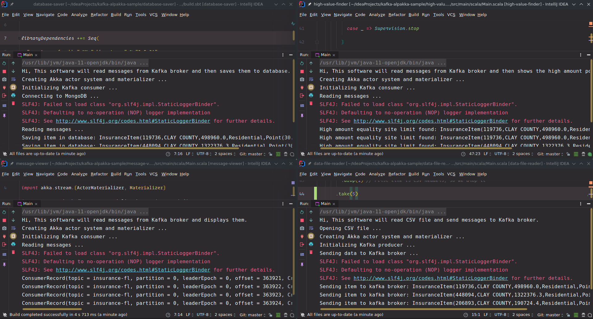

= Kafka Alpakka Sample
Hesam Gholami <hesamgholami@yahoo.com>
v1.0, 2019-05-10

++++
<link rel="stylesheet"  href="http://cdnjs.cloudflare.com/ajax/libs/font-awesome/3.1.0/css/font-awesome.min.css">
++++
:icons: font
:experimental: true

== Quick Start

To use this project we need some tools to be running first.

=== Kafka Server

First we need Kafka server to be running on port `9094` and we need a topic named `insurance-fl`. We use this topic to broadcast our messages.

=== MongoDB Server

One of our consumer apps need to connect to MongoDB server to save its data. So we should provide a MongoDB server available at port `27017`.

For credentials I am using a dummy username and password which is `hesam` and `secret` for a database named `insurance`. But you may probably change these values which are available at the `Main.scala` file in `database-saver` project.

=== Sample File

We have a sample *CSV* file which is in `data` folder and the producer app will use it so broadcast data to Kafka broker.

=== Running Project

To run the project, first we need to start Kafka server, then MongoDB server. Then we can start all consumer apps respectively.

NOTE: We can run projects through terminal or through IDE. I am usin Intellij IDEA to run projects.

    * `message-viewer` will show any message that it will receive.
    * `high-value-finder` will show any insurance item that have an `eqSiteLimit` value of more than *50000*.
    * `database-saver` will save everything that it will receive, to database in a collection named `fl`.

All of these consumers will receive their data from a topic named `insurance-fl` from Kafka broker.

Now we can run producer app which will read or CSV file and send the data to the `insurance-fl` topic in Kafka broker.
    
    * `data-file-reader` will read `FL-insurance-sample.csv` file and send data to Kafka broker.
    
== Tools Description

=== Kafka

For managing stream of data between applications, we use *Kafka*. So it can handle high amuont of messages, passing through applications and it will guarantee the order of messages as well. 

By using Kafka we can also use other tools and languages that are compatible with Kafka API.

=== Akka Streams

Akka stream is used to handle back-pressure in applications and it will use a *Source -> Flow -> Sink* mechanism to manage the streams of high amount data.

This is the fundamendal base of all of our applications.

=== Akka Alpakka Extensions

We use *Alpakka* extensions to connect our tools such as *Kafka* and *MongoDB* to Akka Streams.

This way we have a general mechanism to work with al of our tools and they will have the same API for us to develop.

==== Alpakka Kafka Connector

Using this extension we can connect Akka Streams to Kafka server and produce and consume messages using Kafka broker. This extension will handle the back-pressure for us and let us to control the flow as the way we want.

So we don't even negotiate with dedicated Kafka library and nogotiation with that library will be done with this extension.

==== Alpakka MongoDB Connetor

This extenstion will let us to connect to our MongoDB server with an interface like Akka Streams as well as handling back-pressure for us. So just like Kafka we don't need to negotiate with MongoDB client library directly as it will done inside this extension.

=== Spray JSON

We use this extension to serialize our data using JSON between applications.

== Contributing

If you enjoyed this project, please consider contributing to it and make it better.

And please don't forget to give a star to this project.

Thank you and happy coding!
